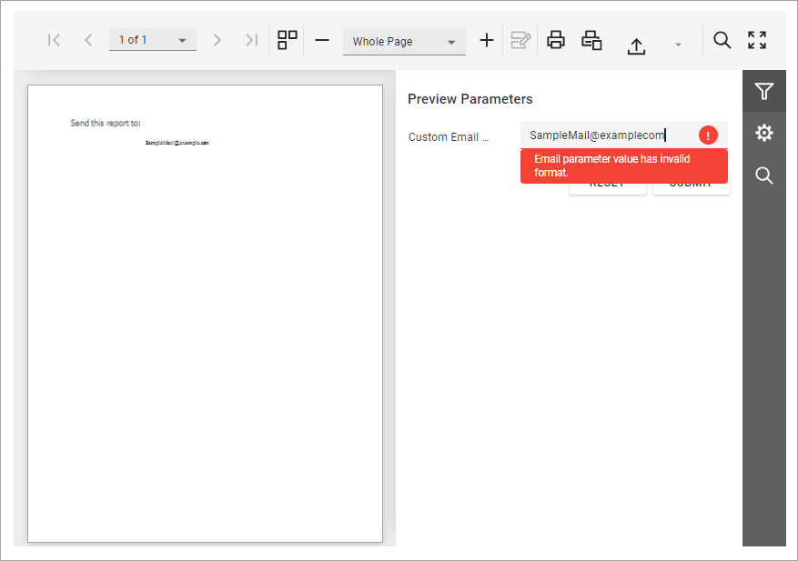

<!-- default badges list -->

<!-- default badges end -->
# Reporting for Angular - Use Template to Implement Custom Client-Side Parameter Editor

This example shows how to use custom types for report parameters, implement serialization/deserialization logic, and create a custom parameter editor. 

## Files to Review

- [CustomParameterType.cs](CustomParameterEditorAngularExample/Services/CustomParameterType.cs)
- [CustomDataSerializer.cs](CustomParameterEditorAngularExample/Services/CustomDataSerializer.cs)
- [CustomParameterReport.cs](CustomParameterEditorAngularExample/PredefinedReports/CustomParameterReport.cs)
- [report-viewer.html](CustomParameterEditorAngularExample/ClientApp/src/app/reportviewer/report-viewer.html)
- [report-viewer.ts](CustomParameterEditorAngularExample/ClientApp/src/app/reportviewer/report-viewer.ts)
- [custom.input.component.html](CustomParameterEditorAngularExample/ClientApp/src/app/custominputcomponent/custom.input.component.html)
- [custom.input.component.ts](CustomParameterEditorAngularExample/ClientApp/src/app/custominputcomponent/custom.input.component.ts)
- [app.component.html](CustomParameterEditorAngularExample/ClientApp/src/app/app.component.html)
- [app.component.ts](CustomParameterEditorAngularExample/ClientApp/src/app/app.component.ts)
- [app.module.ts](CustomParameterEditorAngularExample/ClientApp/src/app/app.component.ts)

## Documentation  

- [Custom Editor for Custom Parameter Type](https://docs.devexpress.com/XtraReports/404694/web-reporting/javascript-reporting/angular/document-viewer/customization/angular-custom-editors-custom-parameter-types)
- [Use Report Parameters](https://docs.devexpress.com/XtraReports/4812/detailed-guide-to-devexpress-reporting/shape-report-data/use-report-parameter)
- [Tasks and Solutions for ASP.NET Core Applications](https://docs.devexpress.com/XtraReports/402406/web-reporting/asp-net-core-reporting/tasks-and-solutions-for-asp-net-core-applications)
<!-- feedback -->
## Does this example address your development requirements/objectives?

 

(you will be redirected to DevExpress.com to submit your response)
<!-- feedback end -->
