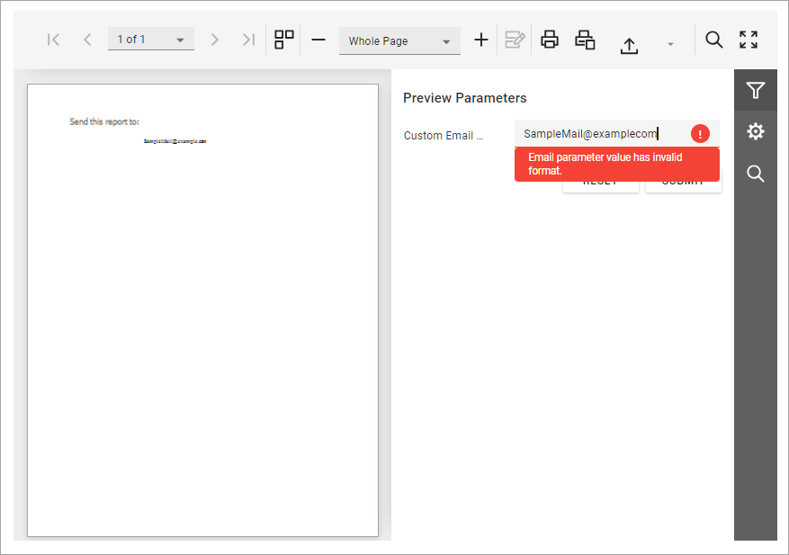

<!-- default badges list -->

[](https://supportcenter.devexpress.com/ticket/details/T1221181)
[](https://docs.devexpress.com/GeneralInformation/403183)
[](#does-this-example-address-your-development-requirementsobjectives)
<!-- default badges end -->
# Reporting for Angular - Create a Custom Editor for a Custom Parameter Type

This example creates a custom type for report parameters, implements serialization/deserialization logic, and implements a custom parameter editor. In this example, a custom email parameter type is implemented with email validation using the DevExtreme `dxTextBox` component.



## Run the Project

Navigate to the *CustomParameterEditor.Server* folder and use the following command to restore dependencies and run the application:

```console
cd CustomParameterEditor.Server
dotnet run
```

Two command prompts appear:

- The ASP.NET Core API project running
- The Angular CLI running the ng start command

Open your browser and navigate to the URL specified in the command output to see the result.

## Implementation Details

1. Create a `CustomParameterType` class with a `Value` property. This class represents a custom parameter type that will be used in the report. 


    ```cs
    using System;

    [TypeConverter(typeof(CustomParameterTypeConverter))]
    public class CustomParameterType {
        public string Value { get; set; }
        public override string ToString() {
            return Value;
        }
    }
    ```

    File to review: [CustomParameterType.cs](CustomParameterEditor.Server/Services/CustomParameterType.cs)

1. Implement a `CustomParameterTypeConverter` converter to display a parameter value in a document.

    For the sample implementation, refer to the following file: [CustomParameterType.cs](CustomParameterEditor.Server/Services/CustomParameterType.cs)

1. Implement a custom parameter serializer. A serializer is necessary to pass data from the client to the controller on the server and store the parameter value in report definition files. 

    For the sample implementation, refer to the following file: [CustomDataSerializer.cs](CustomParameterEditor.Server/Services/CustomDataSerializer.cs)

1. In the [Program.cs](CustomParameterEditor.Server/Program.cs) file, register the `CustomParameterType`, an array of `CustomParameterType`, and the `CustomDataSerializer`: 

    ```cs
    DevExpress.Utils.DeserializationSettings.RegisterTrustedClass(typeof(CustomParameterType));
    DevExpress.Utils.DeserializationSettings.RegisterTrustedClass(typeof(CustomParameterType[]));
    SerializationService.RegisterSerializer(CustomDataSerializer.Name, new CustomDataSerializer());
    ```

1. Add a parameter of a custom type to the report.

    ```cs
    //...
    Parameter customMailParameter = new Parameter {
        Description = "Custom Email Parameter",
        Name = "customMailParameter",
        ValueInfo = "SampleMail@example.com",
        Type = typeof(CustomParameterType),
        Visible = true
    };
    this.Parameters.Add(customMailParameter);
    // ....
    ```
    
    File to review: [CustomParameterReport.cs](CustomParameterEditor.Server/PredefinedReports/CustomParameterReport.cs)


1. Configure the custom parameter editor in the `CustomizeParameterEditors` callback. Specify the custom editor template name and add validation rules:

    ```typescript
    onCustomizeParameterEditors(event): void {
        const parameter = event.args.parameter;
        const info = event.args.info;
        if (parameter.type === 'CustomParameterType') {
            info.validationRules = info.validationRules || [];
            info.validationRules.push(
                { type: 'email', message: 'Email parameter value has invalid format.' });
            info.editor.header = "custom-parameter-text-editor";
        }
    }
    ```

    Files to review: 
    - [report-viewer.html](CustomParameterEditor.Client/src/app/reportviewer/report-viewer.html)
    - [report-viewer.ts](CustomParameterEditor.Client/src/app/reportviewer/report-viewer.ts)

1. Create a custom input component based on the DevExtreme `dxTextBox` component.

    Files to review: 
    - [custom-input-component.html](CustomParameterEditor.Client/src/app/custominputcomponent/custom-input-component.html)
    - [custom-input-component.ts](CustomParameterEditor.Client/src/app/custominputcomponent/custom-input-component.ts)

1. Define an `ng-template` and register it using the `TemplateEngine` service in the `ngAfterViewInit` method to make the custom editor available as `custom-parameter-text-editor`.

    **report-viewer.html:**

    ```html
    <ng-template #myCustomInput let-data="data">
        <custom-input-component [data]="data"></custom-input-component>
    </ng-template>
    ```

    **report-viewer.ts:**
    
    ```typescript
    @ViewChild('myCustomInput') myCustomInput!: TemplateRef<{ data: any }>;

    ngAfterViewInit(): void {
        this._templateEngine.register('custom-parameter-text-editor', this.myCustomInput);
    }
    ```

    Files to review: 
    - [report-viewer.html](CustomParameterEditor.Client/src/app/reportviewer/report-viewer.html)
    - [report-viewer.ts](CustomParameterEditor.Client/src/app/reportviewer/report-viewer.ts)

## Files to Review

- [CustomParameterType.cs](CustomParameterEditor.Server/Services/CustomParameterType.cs)
- [CustomDataSerializer.cs](CustomParameterEditor.Server/Services/CustomDataSerializer.cs)
- [CustomParameterReport.cs](CustomParameterEditor.Server/PredefinedReports/CustomParameterReport.cs)
- [Program.cs](CustomParameterEditor.Server/Program.cs)
- [report-viewer.html](CustomParameterEditor.Client/src/app/reportviewer/report-viewer.html)
- [report-viewer.ts](CustomParameterEditor.Client/src/app/reportviewer/report-viewer.ts)
- [custom-input-component.html](CustomParameterEditor.Client/src/app/custominputcomponent/custom-input-component.html)
- [custom-input-component.ts](CustomParameterEditor.Client/src/app/custominputcomponent/custom-input-component.ts)


## Documentation  

- [Custom Editor for Custom Parameter Type](https://docs.devexpress.com/XtraReports/404694/web-reporting/javascript-reporting/angular/document-viewer/customization/angular-custom-editors-custom-parameter-types)
- [Use Report Parameters](https://docs.devexpress.com/XtraReports/4812/detailed-guide-to-devexpress-reporting/shape-report-data/use-report-parameter)
- [Tasks and Solutions for ASP.NET Core Applications](https://docs.devexpress.com/XtraReports/402406/web-reporting/asp-net-core-reporting/tasks-and-solutions-for-asp-net-core-applications)
<!-- feedback -->
## Does This Example Address Your Development Requirements/Objectives?

[](https://www.devexpress.com/support/examples/survey.xml?utm_source=github&utm_campaign=reporting-angular-custom-parameter-editor&~~~was_helpful=yes) [](https://www.devexpress.com/support/examples/survey.xml?utm_source=github&utm_campaign=reporting-angular-custom-parameter-editor&~~~was_helpful=no)

(you will be redirected to DevExpress.com to submit your response)
<!-- feedback end -->
